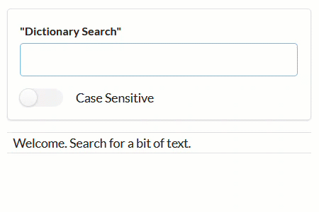

# A Simple Dictionary in React



## Initialize

```shell
npm install
```

```shell
npm start
```

## Search

- Type in some text and press enter. Runs with: `onSubmit`
- Searches using: `startsWith()`
- Top: **Case Sensitive** to return resutls base on uppercase and lowercase letters. Exact mactch starting with... (default = false)
  - Example: `zyth`
